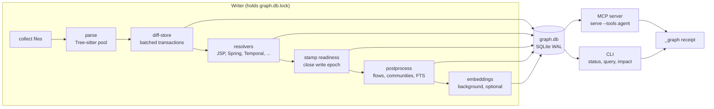

<h1 align="center">code-graph-fullstack</h1>

<p align="center">
  <strong>A local code graph that coding agents can trust: Java and JSP in one graph, with a readiness receipt on every answer.</strong>
</p>

<p align="center">
  <a href="https://github.com/Vex788/code-graph-fullstack/actions/workflows/ci.yml"></a>
  <a href="https://github.com/Vex788/code-graph-fullstack/releases"></a>
  
  <a href="LICENSE"></a>
</p>

## What it is

`code-review-graph` parses a repository with Tree-sitter into a SQLite graph of
files, classes, functions, tests, endpoints and the edges between them. It updates
incrementally on every edit. Agents query it over MCP, and scripts use the CLI, to get
callers, impact radius, affected flows and review context. They get compact answers
instead of reading whole files.

This repository is a fork of
[tirth8205/code-review-graph](https://github.com/tirth8205/code-review-graph). The
fork targets large Java/Stripes/JSP codebases and agent harnesses that must not act on
a stale or half-written graph.

## What this fork adds

- **Fullstack edges.** JSP, JSPF, tag, JS, CSS and XML are indexed. Pages link to
  their ActionBeans (`RENDERS`), to server routes (`REQUESTS`) and to fragments
  (`INCLUDES`). Cross-stack query patterns such as `pages_for` and `included_by`
  answer page-to-handler questions.
- **Readiness contract.** Every tool response carries a `_graph` receipt with one
  status from a fixed state machine. `code-review-graph contract --json` publishes
  the tools, CLI, statuses, exit codes, kinds and JSON Schemas
  ([contract.json](docs/spec/contract.json)).
- **Single-writer lock.** One writer per database, with a kernel file lock that dies
  with its holder and token re-entrancy for child processes. Readers never block.
  A write epoch means an interrupted build reads as `partial_index`, never as `ok`.
- **Stable ids.** Java overloads, anonymous classes, records, static imports and
  member calls get their own identity and bind to the right receiver.
- **Trigger-maintained FTS.** Schema v10 keeps the full-text index current inside
  the write transaction, so there is no separate rebuild step.
- **Embeddings profiles, off by default.** `fast`, `balanced`, `accurate` and
  `legacy` profiles store normalized float16 vectors and re-embed only changed
  nodes in the background.
- **Harness kit.** The hook, skills, agent blocks and rules for Claude Code, ZCode and
  the bug-hunter plugin ship in the package. One command, `laya harness-apply`,
  syncs them.

## Pipeline



Readers never take the lock. They read the stamped readiness and report it.

## 60-second quick start

```bash
# Install the CLI from a tag (or @develop for the latest)
uv tool install "git+https://github.com/Vex788/code-graph-fullstack@v2.3.8-fs.6"

cd your-repo
code-review-graph build                  # first full build
code-review-graph status --json          # readiness.status should be "ok"
code-review-graph serve --tools agent    # MCP server with the 14-tool agent preset
```

Register the server with your MCP client using the command
`code-review-graph serve --tools agent`. After that, `update` (or the harness hook)
keeps the graph current. Pass `--tools all` to expose all 35 tools.

## Semantic search in one line

```bash
code-review-graph embeddings enable --profile balanced
```

Embeddings are **off by default**. Search then runs keyword/FTS, and
`semantic_search_nodes_tool` reports `search_mode` so agents know which one
answered. `CRG_EMBEDDINGS=off|on|fast|balanced|accurate|legacy` overrides the
`[embeddings]` table in `.code-review-graph.toml`.

| Profile | Backend (first importable wins) | Dim | Extra |
|---|---|---|---|
| `fast` | model2vec `minishlab/potion-code-16M-v2` | 256 | `embeddings-fast` |
| `balanced` | MLX on Apple Silicon (after an ONNX parity check), else fastembed ONNX `google/embeddinggemma-300m` | 256 | `embeddings-onnx` / `embeddings-mlx` |
| `accurate` | mlx-lm `Qwen3-Embedding-0.6B-4bit-DWQ` (Apple Silicon; elsewhere falls back to `balanced`) | 512 | `embeddings-mlx` |
| `legacy` | sentence-transformers `BAAI/bge-small-en-v1.5` | 384 | `embeddings` |

Install a profile's extra with the tool, for example:

```bash
uv tool install "code-graph-fullstack[embeddings-onnx] @ git+https://github.com/Vex788/code-graph-fullstack@v2.3.8-fs.6"
```

Cloud providers (`openai`, `google`, `minimax`, `voyage`) are accepted as profile
names too. See [CONFIG.md](docs/spec/CONFIG.md#embeddings).

## Agent contract

**Entry rule:** there is no mandatory entry call. Make the lookup you need
(`query_graph_tool`, or `batch_query_tool` for several at once), then read `_graph`
in the response before trusting it.

| `_graph` field | Use |
|---|---|
| `status`, `reasons` | Act only on `ok`. Treat `partial_index` as degraded. Anything else means prepare the graph first. |
| `built_at_commit`, `current_sha`, `head_matches_build` | Is the graph at HEAD? |
| `source_identity.runtime_matches_source` | Is the running server the installed version? |
| `source_identity.index_matches_runtime` | Are the schema and index generation current? |
| `source_identity.edited_indexed_count` | How many indexed files were edited since the build? |
| `embeddings` | `off`, `ready`, `stale` or `unavailable` |

| Status | Meaning |
|---|---|
| `missing_graph` | No graph for this root: run `build`. |
| `building` | A writer is active: wait and retry. |
| `rebuild_required` | Schema or index generation is older than this build: run `build`. |
| `partial_index` | Interrupted write, or failed files or resolvers: usable, but degraded. |
| `stale_graph` | HEAD moved since the build (or git failed): run `update`. |
| `stale_worktree` | Files on disk are missing from the graph, or indexed files were deleted: run `update`. |
| `ok` | Epoch closed, no failures, generation current, HEAD and source match. |

| Exit code | Meaning |
|---|---|
| 0 | ok |
| 1 | error |
| 2 | usage |
| 3 | degraded (build or update finished partial) |
| 4 | rebuild required |
| 75 | lock busy: another writer holds the graph (hooks treat this as a no-op) |

Details: [READINESS.md](docs/spec/READINESS.md).

## Fullstack edges

| Edge | From → to | State |
|---|---|---|
| `RENDERS` | JSP → ActionBean / Endpoint (`useActionBean`, `beanclass`) | now |
| `REQUESTS` | JSP/JS URL → Endpoint or handler | now (jQuery `$.ajax` planned) |
| `INCLUDES` | JSP → JSPF / script | now |
| `REFERENCES` | page → script, stylesheet, page | now |
| `INJECTS` | ActionBean → Spring bean (`@SpringBean`) | now |
| `FORWARDS_TO` | handler → JSP (`ForwardResolution`, `RedirectResolution`) | planned |
| `HANDLES_EVENT` | method → Stripes event (`@HandlesEvent`, `@DefaultHandler`) | planned |
| `BINDS` | form field → bean property | planned |
| `USES_STYLE` | `class=` → CSS selector | planned |
| `MAPS_TO` | `@Entity` / `*.hbm.xml` → table | planned |

Planned kinds are already in the registry ([EDGES.md](docs/spec/EDGES.md)). Their
query patterns return empty until the edges are produced.

**Example** (the `tests/fixtures/fullstack_stripes` fixture): JSP → ActionBean →
service → DAO → table.

```bash
code-review-graph query pages_for OrderActionBean
#   web/WEB-INF/jsp/order/view.jsp               (RENDERS)
code-review-graph query included_by web/WEB-INF/jsp/common/header.jspf
#   2 pages include the header
code-review-graph query callees_of OrderActionBean.place
#   includes OrderService.place                  (CALLS; then OrderDao.persist)
code-review-graph query maps_to Order
#   0 results today; table:orders once MAPS_TO lands
```

`callers_of` and `importers_of` follow only `CALLS` and `IMPORTS_FROM`, so they never
return pages. Use `pages_for`, `requests_to`, `included_by`, `views_of`,
`forwards_to`, `maps_to`, `binds_to` and `styles_of` for cross-stack questions.

## Performance

These are stage timings from `python -m code_review_graph.eval.benchmarks.stage_timing
--scale 2000 --repeat 3`, run on a 4-core Linux container (x86_64, Python 3.11,
SQLite 3.45). The raw data is in [docs/perf/baseline.json](docs/perf/baseline.json)
and [docs/perf/fs6-current.json](docs/perf/fs6-current.json).

**Generated Stripes fixture, 1,999 files** (the same tree in every column):

| Stage (seconds) | Baseline (7eb5e82) | Before W4b (158746c) | fs.6 (05057eb) |
|---|---|---|---|
| Parse, store and resolvers | 4.77 | 2.33 | **1.99** |
| Post-process | 2.75 | 1.92 | **1.54** |
| Full build, total | 7.52 | 4.24 | **3.53** |
| JSP resolver | 0.53 | 0.10 | **0.04** |
| No-op update (median) | 0.144 | 0.039 | **0.038** |
| One-file update (median) | 1.20 | 0.71 | **0.45** |

**This repository's own tree, 418 files** (the two right-hand columns ran back to
back; the baseline tree had 305 files):

| Stage (seconds) | Baseline | Before W4b | fs.6 |
|---|---|---|---|
| Full build, total | 9.72 | 8.33 | 8.26 |
| No-op update (median) | 0.042 | 0.033 | 0.028 |
| One-file update (median) | 0.64 | 0.71 | 1.01 |

The one-file update on this tree is slower in fs.6. Its post-process spends 0.47 s on
communities, which the fixture does not trigger. This is a known item for the next
release.

## Harness integration

The package ships a harness kit: a PostToolUse update hook, four skills
(code-search-routing, context-efficient-code-research, pr-context-pack,
graph-bootstrap), agent text blocks and `crg_rules.json`, which is generated from the
contract. The kit writes only its own files and marker regions. It records their
hashes in `.crg-kit.lock.json` and never touches a file it does not own without
`--adopt`.

All config writing, including `settings.json`, MCP entries and permissions, belongs
to **laya**. laya merges the fragment from
`code-review-graph harness fragment --target T --json` and tracks each entry's owner
in a digest ledger.

```bash
laya harness-apply --dry-run --adopt   # first time: review what would be taken over
laya harness-apply --adopt
laya harness-apply --check             # exit 0 means everything is in sync
```

See [HARNESS.md](docs/spec/HARNESS.md) for targets, regions, drift kinds and the
ownership rules.

## Troubleshooting

| Symptom | Cause | Fix |
|---|---|---|
| `status: missing_graph` | No graph for this root, or `CRG_DATA_DIR` points elsewhere. | `code-review-graph build`, then `status --json`. |
| `update` exits 4, `rebuild_required` | This release raised the index generation (to 2) or the schema version (to 10). | Run `code-review-graph build` once. |
| Exit 75, "lock busy" | Another build, update or hook worker holds `graph.db.lock`. | Wait, or use `--if-locked wait --lock-wait 300`. Hooks skip on 75 by design. |
| `stale_worktree` although you only edited files | Edits alone never cause it. It means new files missing from the graph, or indexed files deleted. | Run `code-review-graph update`. Edits show up in `source_identity.edited_indexed_count`. |
| `embeddings: unavailable` | The profile's extra is not installed, or the model cannot download (offline). | Install the extra from the profile table, pre-fetch the model, or switch to `--profile fast`. Keyword search keeps working. |

## Docs

- [docs/INDEX.md](docs/INDEX.md): everything
- [TOOLS.md](docs/spec/TOOLS.md): every MCP tool, parameters, presets (generated)
- [CLI.md](docs/spec/CLI.md): every command and option (generated)
- [EDGES.md](docs/spec/EDGES.md): node and edge kinds (generated)
- [READINESS.md](docs/spec/READINESS.md): statuses, write epoch, lock, exit codes, receipt
- [CONFIG.md](docs/spec/CONFIG.md): every `CRG_*` variable and config file
- [HARNESS.md](docs/spec/HARNESS.md): kit, fragment, ownership
- [CHANGELOG.md](CHANGELOG.md)

## Credits

This project is built on [code-review-graph](https://github.com/tirth8205/code-review-graph)
by Tirth Kanani and contributors, and is released under the same
[MIT License](LICENSE). The localized READMEs are upstream translations.
